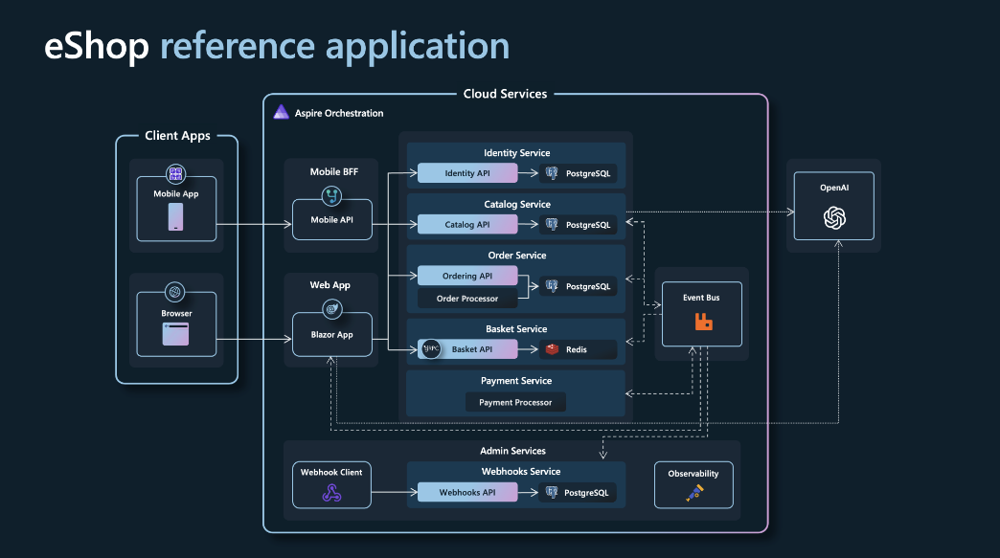

# Trabalho 1: Estudo e Caracterização de Aplicações de Microsserviços de Código Aberto

Este repositório reúne a documentação do Trabalho 1 da disciplina de Sistemas Distribuídos, cujo objetivo é estudar e caracterizar aplicações de microsserviços de código aberto. A análise considera aspectos arquiteturais, tecnológicos e operacionais, com foco em aplicações adequadas para experimentos em ambientes distribuídos, especialmente com Docker, Kubernetes, observabilidade e resiliência.

As aplicações são descritas a partir de um protocolo comum de caracterização, contemplando identificação geral, estrutura arquitetural, implementação, dados e persistência, implantação e operação, além da adequação para atividades de laboratório.

## Aplicações analisadas

1. [Istio Bookinfo Application](#1-istio-bookinfo-application)

## 1. Istio Bookinfo Application

### Identificação geral

**Nome da aplicação:** Istio Bookinfo  
**Domínio:** aplicação web de catálogo e avaliação de livros, semelhante a uma livraria online simplificada  
**Repositório:** [github.com/istio/istio/tree/master/samples/bookinfo](https://github.com/istio/istio/tree/master/samples/bookinfo)  
**Documentação oficial:** [Istio Bookinfo Application](https://istio.io/latest/docs/examples/bookinfo/)  
**Organização responsável:** Istio  
**Finalidade:** demonstração tecnológica para estudo de microsserviços e service mesh  
**Status:** ativo como exemplo oficial mantido na documentação do Istio  
**Classificação:** aplicação educacional e ambiente sandbox para observabilidade, roteamento de tráfego e resiliência

O Bookinfo é uma aplicação de exemplo disponibilizada pelo projeto Istio para demonstrar recursos de service mesh em uma arquitetura de microsserviços. A aplicação simula uma página de livro com descrição, detalhes, avaliações e notas, funcionando como um domínio de e-commerce simplificado.

### Estrutura arquitetural

O Istio Bookinfo é composto por quatro microsserviços principais:

- `productpage`: responsável pelo frontend da aplicação; chama os serviços `details` e `reviews` para montar a página exibida ao usuário.
- `details`: fornece informações do livro, como ISBN, número de páginas e dados descritivos.
- `reviews`: gerencia avaliações dos usuários e pode chamar o serviço `ratings`.
- `ratings`: fornece as notas associadas às avaliações.

*Figura 1: visão geral da arquitetura do Istio Bookinfo, destacando os principais microsserviços, suas comunicações e os componentes de observabilidade associados ao ambiente Istio.*

A arquitetura apresenta separação clara entre frontend e backend, com cada funcionalidade tratada por um serviço independente. A comunicação entre os serviços ocorre de forma síncrona via HTTP. Quando executada com Istio, essa comunicação é intermediada por proxies sidecar, que permitem controlar tráfego, coletar telemetria e aplicar políticas sem alterar diretamente o código dos serviços.

Características principais:

- separação clara de responsabilidades entre serviços;
- comunicação síncrona via HTTP;
- uso de service mesh para controle de tráfego, telemetria e políticas;
- suporte a múltiplas versões do serviço `reviews` (`v1`, `v2` e `v3`);
- ausência de filas ou mecanismos de mensageria;
- baixa dependência entre serviços, favorecendo experimentos controlados.

As versões do serviço `reviews` são usadas para demonstrar roteamento e testes de tráfego:

- `reviews v1`: não chama o serviço `ratings`;
- `reviews v2`: chama `ratings` e exibe estrelas pretas;
- `reviews v3`: chama `ratings` e exibe estrelas vermelhas.

### Implementação

Seus microsserviços são implementados em diferentes linguagens. Essa característica é relevante para o estudo de microsserviços, já que demonstra como serviços independentes podem coexistir mesmo quando usam stacks distintas.

Tecnologias observadas:

- Python;
- Ruby;
- Java;
- Node.js.

Cada microsserviço possui sua própria base de código e pode utilizar frameworks e dependências específicas. O foco do exemplo não está em regras de negócio complexas, mas na demonstração de comunicação entre serviços, controle de versões e integração com o Istio.

Características observadas:

- alto grau de desacoplamento entre serviços;
- organização modular por serviço;
- heterogeneidade tecnológica;
- presença de múltiplas versões de serviço para testes de roteamento;

### Dados e persistência

O Bookinfo não possui uma arquitetura complexa de persistência de dados. Os dados utilizados pela aplicação são simples, estáticos ou simulados, e não há dependência central de bancos de dados complexos.

Características:

- uso limitado de armazenamento de dados;
- ausência de bancos de dados relacionais ou distribuídos na arquitetura principal;
- dados simplificados para apoiar a demonstração da aplicação;
- foco maior na comunicação entre serviços do que na gestão de dados.

Essa escolha torna o Bookinfo diferente de sistemas reais de produção, mas facilita seu uso em laboratórios. Como a camada de dados é simples, os experimentos podem se concentrar em tópicos como roteamento, falhas, observabilidade, latência e comportamento da malha de serviços.

### Implantação e operação

A aplicação possui forte suporte a ambientes conteinerizados e orquestrados:

- suporte a Docker;
- suporte completo a Kubernetes;
- manifestos de implantação em YAML;
- integração direta com o Istio;

Recursos de observabilidade associados ao ecossistema Istio:

- Prometheus para coleta de métricas;
- Grafana para visualização de métricas;
- Jaeger para tracing distribuído;
- Kiali para visualização da topologia e comunicação entre serviços.

Recursos de resiliência e controle de tráfego que podem ser explorados:

- fault injection;
- traffic shifting;
- canary deployment;
- circuit breaking;
- roteamento por versão;
- análise de comportamento sob falhas controladas.

A complexidade de implantação é considerada média. A aplicação em si é simples, mas a configuração do Istio e dos componentes de observabilidade exige familiaridade com Kubernetes, namespaces, gateways, destination rules, virtual services e injeção de sidecars.

### Adequação para uso em atividades de laboratório

**Adequação para Kubernetes:** excelente  
**Adequação para observabilidade:** excelente  
**Adequação para testes de desempenho:** boa  
**Adequação para testes de resiliência:** excelente  
**Complexidade operacional:** média

Vantagens:

- arquitetura clara de microsserviços;
- forte integração com Kubernetes;
- excelente suporte a observabilidade;
- ideal para experimentos de resiliência e controle de tráfego;
- múltiplas versões de serviço prontas para testes;
- amplamente utilizado em contextos acadêmicos e tutoriais técnicos.

Limitações:

- aplicação simplificada;
- domínio pouco realista quando comparado a sistemas de produção;
- baixa complexidade de dados;
- ausência de fluxos completos de negócio;
- não representa integralmente os desafios de um sistema corporativo em produção.

### Conclusão

O Istio Bookinfo apresenta uma implementação clara e estruturada de microsserviços, sendo especialmente adequado para estudos de comunicação entre serviços, observabilidade e resiliência em ambientes Kubernetes. Apesar de seu caráter didático, oferece um ambiente controlado e rico para experimentação, tornando-se altamente relevante para uso em atividades de laboratório.

Sua principal contribuição para o trabalho está em oferecer uma arquitetura simples, clara e bem documentada de microsserviços, permitindo analisar a separação de responsabilidades, a comunicação entre serviços, o uso de múltiplas versões e a implantação em Kubernetes. A integração com o Istio acrescenta recursos úteis para experimentos de observabilidade, roteamento e resiliência, mas atua como um apoio operacional, não como o foco principal da aplicação.

## 2. eShopOnContainers

### Identificação geral

**Nome da aplicação:** eShopOnContainers  
**Domínio:** aplicação de comércio eletrônico (e-commerce)  
**Repositório:** https://github.com/dotnet/eShop  
**Organização responsável:** Microsoft  
**Finalidade:** demonstração arquitetural de microsserviços corporativos em .NET  
**Status:** ativo como projeto de referência para arquitetura de microsserviços  
**Classificação:** aplicação educacional com foco em cenários corporativos reais

O eShopOnContainers é uma aplicação open source desenvolvida pela Microsoft com o objetivo de demonstrar a construção de um sistema de e-commerce baseado em arquitetura de microsserviços. A aplicação simula uma loja virtual completa, incluindo funcionalidades como catálogo de produtos, carrinho de compras, pedidos, autenticação, pagamento e promoções.

Diferentemente de exemplos mais simplificados, o eShop busca representar um cenário mais próximo de sistemas corporativos reais, incorporando padrões modernos de arquitetura distribuída.

---

### Estrutura arquitetural

O eShopOnContainers é composto por diversos microsserviços independentes, cada um responsável por uma funcionalidade específica do sistema.

Principais serviços:

- `Catalog.API`: responsável pelo gerenciamento do catálogo de produtos;
- `Basket.API`: gerencia o carrinho de compras;
- `Ordering.API`: responsável pelo processamento e gerenciamento de pedidos;
- `Identity.API`: responsável por autenticação e autorização;
- `Webhooks.API`: gerencia notificações externas via webhooks;

A arquitetura apresenta:

- separação clara entre frontend e backend;
- uso de API Gateway para centralizar o acesso;
- utilização de BFF (Backend for Frontend) para adaptação de dados a diferentes clientes;
- baixo acoplamento entre serviços.

A comunicação entre os serviços é híbrida:

- síncrona via HTTP/REST e gRPC;
- assíncrona via mensageria (RabbitMQ ou Azure Service Bus).

Essa abordagem permite maior escalabilidade e resiliência, além de facilitar a evolução independente dos serviços.

---

### Implementação

A aplicação é desenvolvida majoritariamente utilizando tecnologias do ecossistema .NET.

Tecnologias observadas:

- C#;
- ASP.NET Core;
- .NET 9;
- Blazor Web App (frontend).

Características observadas:

- padronização tecnológica entre os serviços;
- organização modular por microsserviço;
- uso de padrões arquiteturais modernos;
- forte integração com ferramentas do ecossistema Microsoft.

---

### Dados e persistência

O eShopOnContainers adota o padrão **database per service**, no qual cada microsserviço possui seu próprio banco de dados.

Tecnologias utilizadas:

- SQL Server para serviços como catálogo, pedidos e autentação;
- Redis para cache e gerenciamento do carrinho;
- RabbitMQ ou Azure Service Bus para comunicação assíncrona.

Características:

- isolamento de dados por serviço;
- maior independência entre microsserviços;
- suporte a escalabilidade e resiliência;
- uso combinado de armazenamento relacional e em memória.

---

### Implantação e operação

A aplicação possui suporte completo a ambientes conteinerizados e orquestrados.

Recursos disponíveis:

- Dockerfiles individuais para cada serviço;
- suporte a docker-compose;
- implantação em Kubernetes;
- integração com Azure Kubernetes Service (AKS).

Recursos de observabilidade:

- OpenTelemetry para coleta de dados;
- logs centralizados;
- tracing distribuído;
- métricas de monitoramento.

Recursos operacionais:

- suporte a escalabilidade horizontal;
- integração com pipelines de CI/CD;
- monitoramento de serviços distribuídos.

A complexidade de implantação é considerada alta, devido à quantidade de serviços e à infraestrutura necessária.

---

### Adequação para uso em atividades de laboratório

**Adequação para Kubernetes:** excelente  
**Adequação para observabilidade:** excelente  
**Adequação para testes de desempenho:** excelente  
**Adequação para testes de resiliência:** excelente  
**Complexidade operacional:** alta  

Vantagens:

- arquitetura próxima de sistemas reais;
- uso de múltiplos padrões de microsserviços;
- forte integração com ferramentas modernas;
- ideal para estudos avançados de sistemas distribuídos;
- suporte completo a observabilidade e mensageria.

Limitações:

- alta complexidade de configuração;
- forte dependência do ecossistema .NET e Azure;
- curva de aprendizado elevada;
- maior dificuldade para execução em ambientes limitados.

---

### Conclusão

O eShopOnContainers apresenta uma arquitetura robusta e completa de microsserviços, sendo altamente adequado para estudos avançados em sistemas distribuídos. Sua principal contribuição está na representação de um cenário próximo ao ambiente corporativo real, permitindo explorar aspectos como comunicação híbrida, mensageria, observabilidade e escalabilidade.

Apesar de sua complexidade, o projeto se destaca como uma referência sólida para compreensão de arquiteturas modernas baseadas em microsserviços.

## Referências

- [Istio: Bookinfo Application](https://istio.io/latest/docs/examples/bookinfo/)
- [Repositório oficial do Istio](https://github.com/istio/istio)

