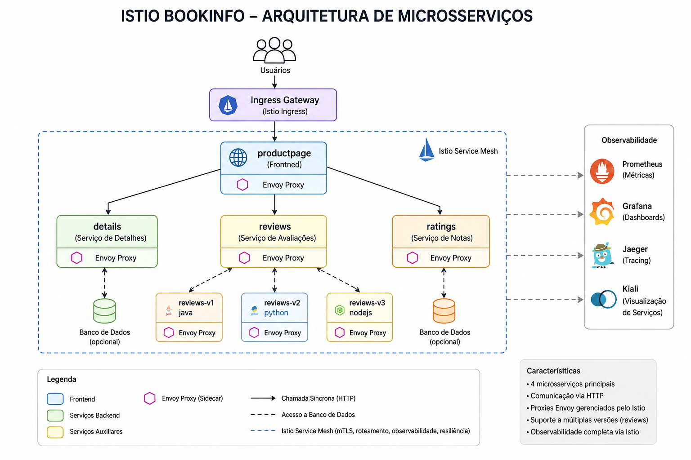

# Trabalho 1: Estudo e Caracterização de Aplicações de Microsserviços de Código Aberto

Este repositório reúne a documentação do Trabalho 1 da disciplina de Sistemas Distribuídos, cujo objetivo é estudar e caracterizar aplicações de microsserviços de código aberto. A análise considera aspectos arquiteturais, tecnológicos e operacionais, com foco em aplicações adequadas para experimentos em ambientes distribuídos, especialmente com Docker, Kubernetes, observabilidade e resiliência.

As aplicações são descritas a partir de um protocolo comum de caracterização, contemplando identificação geral, estrutura arquitetural, implementação, dados e persistência, implantação e operação, além da adequação para atividades de laboratório.

## Aplicações analisadas

1. [Istio Bookinfo Application](#1-istio-bookinfo-application)

## 1. Istio Bookinfo Application

### Identificação geral

**Nome da aplicação:** Istio Bookinfo  
**Domínio:** aplicação web de catálogo e avaliação de livros, semelhante a uma livraria online simplificada  
**Repositório:** [github.com/istio/istio/tree/master/samples/bookinfo](https://github.com/istio/istio/tree/master/samples/bookinfo)  
**Documentação oficial:** [Istio Bookinfo Application](https://istio.io/latest/docs/examples/bookinfo/)  
**Organização responsável:** Istio  
**Finalidade:** demonstração tecnológica para estudo de microsserviços e service mesh  
**Status:** ativo como exemplo oficial mantido na documentação do Istio  
**Classificação:** aplicação educacional e ambiente sandbox para observabilidade, roteamento de tráfego e resiliência

O Bookinfo é uma aplicação de exemplo disponibilizada pelo projeto Istio para demonstrar recursos de service mesh em uma arquitetura de microsserviços. A aplicação simula uma página de livro com descrição, detalhes, avaliações e notas, funcionando como um domínio de e-commerce simplificado.

### Estrutura arquitetural

O Istio Bookinfo é composto por quatro microsserviços principais:

- `productpage`: responsável pelo frontend da aplicação; chama os serviços `details` e `reviews` para montar a página exibida ao usuário.
- `details`: fornece informações do livro, como ISBN, número de páginas e dados descritivos.
- `reviews`: gerencia avaliações dos usuários e pode chamar o serviço `ratings`.
- `ratings`: fornece as notas associadas às avaliações.

*Figura 1: visão geral da arquitetura do Istio Bookinfo, destacando os principais microsserviços, suas comunicações e os componentes de observabilidade associados ao ambiente Istio.*

A arquitetura apresenta separação clara entre frontend e backend, com cada funcionalidade tratada por um serviço independente. A comunicação entre os serviços ocorre de forma síncrona via HTTP. Quando executada com Istio, essa comunicação é intermediada por proxies sidecar, que permitem controlar tráfego, coletar telemetria e aplicar políticas sem alterar diretamente o código dos serviços.

Características principais:

- separação clara de responsabilidades entre serviços;
- comunicação síncrona via HTTP;
- uso de service mesh para controle de tráfego, telemetria e políticas;
- suporte a múltiplas versões do serviço `reviews` (`v1`, `v2` e `v3`);
- ausência de filas ou mecanismos de mensageria;
- baixa dependência entre serviços, favorecendo experimentos controlados.

As versões do serviço `reviews` são usadas para demonstrar roteamento e testes de tráfego:

- `reviews v1`: não chama o serviço `ratings`;
- `reviews v2`: chama `ratings` e exibe estrelas pretas;
- `reviews v3`: chama `ratings` e exibe estrelas vermelhas.

### Implementação

Seus microsserviços são implementados em diferentes linguagens. Essa característica é relevante para o estudo de microsserviços, já que demonstra como serviços independentes podem coexistir mesmo quando usam stacks distintas.

Tecnologias observadas:

- Python;
- Ruby;
- Java;
- Node.js.

Cada microsserviço possui sua própria base de código e pode utilizar frameworks e dependências específicas. O foco do exemplo não está em regras de negócio complexas, mas na demonstração de comunicação entre serviços, controle de versões e integração com o Istio.

Características observadas:

- alto grau de desacoplamento entre serviços;
- organização modular por serviço;
- heterogeneidade tecnológica;
- presença de múltiplas versões de serviço para testes de roteamento;

### Dados e persistência

O Bookinfo não possui uma arquitetura complexa de persistência de dados. Os dados utilizados pela aplicação são simples, estáticos ou simulados, e não há dependência central de bancos de dados complexos.

Características:

- uso limitado de armazenamento de dados;
- ausência de bancos de dados relacionais ou distribuídos na arquitetura principal;
- dados simplificados para apoiar a demonstração da aplicação;
- foco maior na comunicação entre serviços do que na gestão de dados.

Essa escolha torna o Bookinfo diferente de sistemas reais de produção, mas facilita seu uso em laboratórios. Como a camada de dados é simples, os experimentos podem se concentrar em tópicos como roteamento, falhas, observabilidade, latência e comportamento da malha de serviços.

### Implantação e operação

A aplicação possui forte suporte a ambientes conteinerizados e orquestrados:

- suporte a Docker;
- suporte completo a Kubernetes;
- manifestos de implantação em YAML;
- integração direta com o Istio;

Recursos de observabilidade associados ao ecossistema Istio:

- Prometheus para coleta de métricas;
- Grafana para visualização de métricas;
- Jaeger para tracing distribuído;
- Kiali para visualização da topologia e comunicação entre serviços.

Recursos de resiliência e controle de tráfego que podem ser explorados:

- fault injection;
- traffic shifting;
- canary deployment;
- circuit breaking;
- roteamento por versão;
- análise de comportamento sob falhas controladas.

A complexidade de implantação é considerada média. A aplicação em si é simples, mas a configuração do Istio e dos componentes de observabilidade exige familiaridade com Kubernetes, namespaces, gateways, destination rules, virtual services e injeção de sidecars.

### Adequação para uso em atividades de laboratório

**Adequação para Kubernetes:** excelente  
**Adequação para observabilidade:** excelente  
**Adequação para testes de desempenho:** boa  
**Adequação para testes de resiliência:** excelente  
**Complexidade operacional:** média

Vantagens:

- arquitetura clara de microsserviços;
- forte integração com Kubernetes;
- excelente suporte a observabilidade;
- ideal para experimentos de resiliência e controle de tráfego;
- múltiplas versões de serviço prontas para testes;
- amplamente utilizado em contextos acadêmicos e tutoriais técnicos.

Limitações:

- aplicação simplificada;
- domínio pouco realista quando comparado a sistemas de produção;
- baixa complexidade de dados;
- ausência de fluxos completos de negócio;
- não representa integralmente os desafios de um sistema corporativo em produção.

### Conclusão

O Istio Bookinfo apresenta uma implementação clara e estruturada de microsserviços, sendo especialmente adequado para estudos de comunicação entre serviços, observabilidade e resiliência em ambientes Kubernetes. Apesar de seu caráter didático, oferece um ambiente controlado e rico para experimentação, tornando-se altamente relevante para uso em atividades de laboratório.

Sua principal contribuição para o trabalho está em oferecer uma arquitetura simples, clara e bem documentada de microsserviços, permitindo analisar a separação de responsabilidades, a comunicação entre serviços, o uso de múltiplas versões e a implantação em Kubernetes. A integração com o Istio acrescenta recursos úteis para experimentos de observabilidade, roteamento e resiliência, mas atua como um apoio operacional, não como o foco principal da aplicação.

## eShopOnContainers

O **eShopOnContainers** é uma aplicação open source desenvolvida pela Microsoft para demonstrar como construir um sistema de comércio eletrônico utilizando arquitetura de microsserviços em .NET 9.

O sistema simula uma loja virtual completa, com catálogo de produtos, carrinho, pedidos, autenticação, pagamento e promoções. Seu objetivo é servir como referência para aplicações corporativas reais.

---

### Informações Gerais

- **Repositório:** https://github.com/dotnet/eShop  
- **Organização:** Microsoft  
- **Domínio:** e-commerce  
- **Finalidade:** exemplo de microsserviços corporativos em .NET  

---

### Estrutura Arquitetural

A aplicação é composta por diversos microsserviços, incluindo:

- **Catalog.API** – catálogo de produtos  
- **Basket.API** – carrinho de compras  
- **Ordering.API** – gerenciamento de pedidos  
- **Webhooks.API** – webhooks  
- **Identity.API** – autenticação e autorização  

Há uma separação clara entre **front-end** e **back-end**, além da presença de:

- **API Gateway**
- **BFF (Backend for Frontend)** – adapta dados para diferentes clientes  

### Comunicação

A comunicação entre serviços é híbrida:

- **Síncrona:** HTTP/REST e gRPC  
- **Assíncrona:** RabbitMQ ou Azure Service Bus  

---

### Implementação

- **Linguagem:** C#  
- **Framework:** ASP.NET Core / .NET 9  
- **Front-end:** Blazor Web App  

O projeto é altamente padronizado, pois a maioria dos serviços utiliza as mesmas tecnologias.

---

### Dados e Persistência

Segue o padrão **database per service**, onde cada microsserviço possui seu próprio banco:

- **SQL Server:** catálogo, pedidos, marketing e autenticação  
- **Redis:** carrinho e cache  
- **RabbitMQ / Azure Service Bus:** mensageria  

---

### Implantação

O projeto oferece suporte completo para:

- Dockerfiles individuais  
- docker-compose  
- Kubernetes  
- Azure Kubernetes Service (AKS)  

### Observabilidade

Inclui integração com:

- OpenTelemetry  
- logs centralizados  
- tracing distribuído  
- métricas para monitoramento  

---

### Casos de Uso para Estudo

O eShopOnContainers é muito adequado para estudos de:

- Docker e Kubernetes  
- API Gateway e BFF  
- mensageria e arquitetura orientada a eventos  
- database per service  
- observabilidade e tracing distribuído  
- testes de desempenho, escalabilidade e resiliência  

---

### Vantagens

Uma das principais vantagens do eShop é reunir, em uma única aplicação, vários conceitos importantes de microsserviços, como:

- API Gateway  
- mensageria  
- banco por serviço  
- Docker e Kubernetes  
- observabilidade  

Tudo isso de forma organizada e próxima de um ambiente corporativo real, tornando-o excelente para estudo e experimentação.

---

### Limitações

- Alta complexidade de implantação  
- Forte dependência do ecossistema **.NET** e **Azure**  
- Pode ser difícil para equipes sem experiência nessas tecnologias

## Referências

- [Istio: Bookinfo Application](https://istio.io/latest/docs/examples/bookinfo/)
- [Repositório oficial do Istio](https://github.com/istio/istio)

